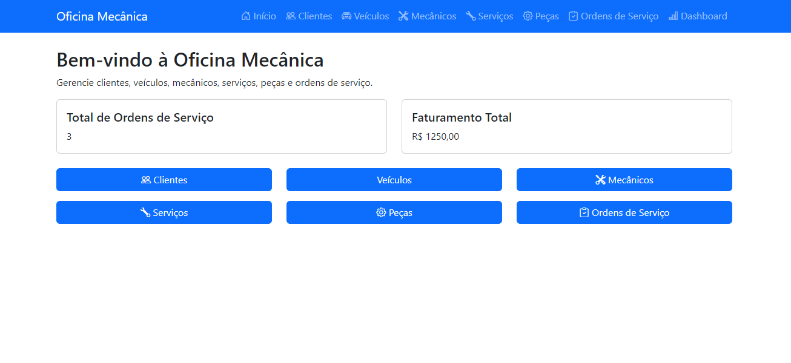
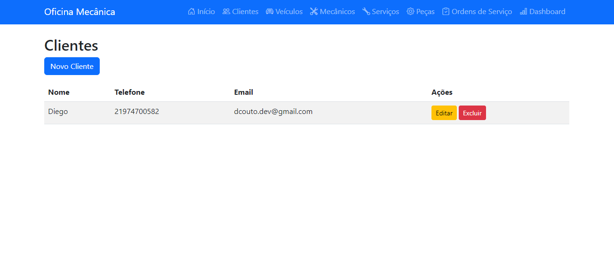
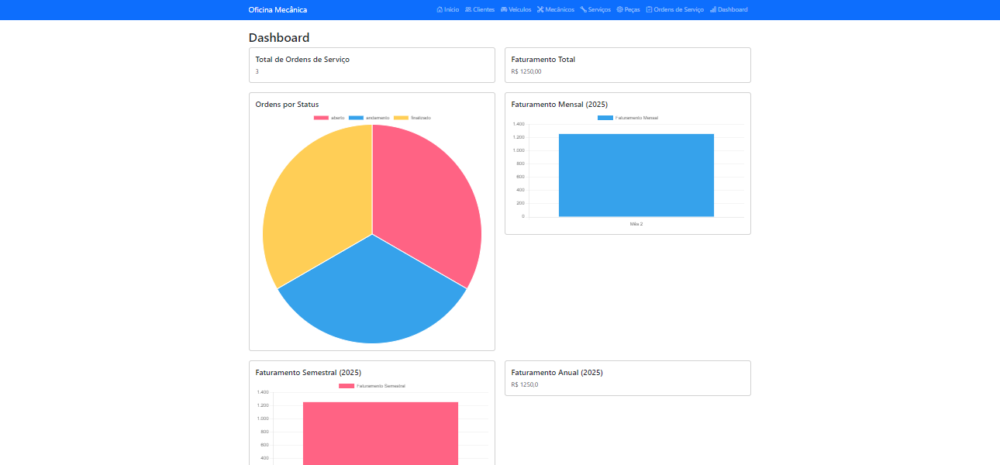

 # 🚗 Sistema de Gerenciamento de Oficina Mecânica

Bem-vindo ao **Sistema de Gerenciamento de Oficina Mecânica**! Este projeto foi desenvolvido para ajudar oficinas mecânicas a gerenciar clientes, veículos, serviços, peças e ordens de serviço de forma eficiente e organizada. Com uma interface simples e intuitiva, você pode controlar tudo o que acontece na sua oficina em um único lugar.

👉 **Acesse o site:** [Link do Site](#) *(em breve)*

---

## 📸 Fotos do Projeto

Aqui estão algumas imagens do sistema em funcionamento:

| Página Inicial | Lista de Clientes | Dashboard |
|----------------|-------------------|-----------|
|  |  |  |

---

## 🛠️ Funcionalidades Principais

O sistema oferece as seguintes funcionalidades:

- **Clientes**: Cadastro e gerenciamento de clientes, incluindo nome, telefone, e-mail e endereço.
- **Veículos**: Registro de veículos dos clientes, com informações como marca, modelo, ano, cor e placa.
- **Mecânicos**: Cadastro de mecânicos, com nome, telefone e especialidade.
- **Serviços**: Lista de serviços oferecidos pela oficina, com nome e valor.
- **Peças**: Controle de peças utilizadas nos serviços, com nome e valor.
- **Ordens de Serviço**: Criação e gerenciamento de ordens de serviço, incluindo descrição do defeito, valor total e status.
- **Dashboard**: Relatórios e gráficos sobre o funcionamento da oficina, como número de ordens de serviço e faturamento mensal.

---

## 🚀 Como Usar o Sistema

### Passo 1: Acesse o Sistema
1. Acesse o site do sistema: [Link do Site](#) *(em breve)*.
2. Faça login com suas credenciais (se necessário).

### Passo 2: Navegue pelo Sistema
- Use o menu no topo da página para acessar as diferentes seções:
  - **Clientes**: Cadastre e gerencie os clientes da oficina.
  - **Veículos**: Registre os veículos dos clientes.
  - **Mecânicos**: Cadastre os mecânicos da oficina.
  - **Serviços**: Adicione e gerencie os serviços oferecidos.
  - **Peças**: Controle as peças utilizadas nos serviços.
  - **Ordens de Serviço**: Crie e acompanhe as ordens de serviço.
  - **Dashboard**: Veja gráficos e relatórios sobre o funcionamento da oficina.

### Passo 3: Adicione Dados
- Clique no botão **Novo** em qualquer seção para adicionar novos registros (clientes, veículos, serviços, etc.).
- Preencha os campos do formulário e clique em **Salvar**.

### Passo 4: Visualize e Edite Dados
- Na lista de registros, clique em **Editar** para modificar informações ou em **Excluir** para remover um registro.

### Passo 5: Acompanhe o Dashboard
- Na página do **Dashboard**, veja gráficos e métricas sobre o desempenho da oficina, como número de ordens de serviço e faturamento mensal.

---

## 💻 Como Executar o Projeto Localmente

Se você é um desenvolvedor ou quer testar o projeto no seu computador, siga os passos abaixo:

### Pré-requisitos
- Python 3.x instalado.
- Git instalado (opcional, mas recomendado).

### Passo 1: Clone o Repositório
1. Abra o terminal e execute:
   ```bash
   git clone "" https://github.com/couto-diego/oficina-mecanica

2. Navegue até a pasta do projeto:
    ````
    cd repositorio

### Passo 2: Crie um Ambiente Virtual
1. Crie um ambiente virtual:
    ````
    python -m venv myenv

2. Ative o ambiente virtual:
    No Windows:
    ````
    source myenv\Scripts\activate

    No macOS/Linux:
    ````
    source myenv/bin/activate

### Passo 3: Instale as Dependências
1. Instale as dependências do projeto:
    ````
    pip install -r requirements.txt

    Dependências Necessárias
    O projeto utiliza as seguintes bibliotecas principais:
    - Django: Framework web para desenvolvimento rápido.
    - mysqlclient: Conector para banco de dados MySQL (se estiver usando MySQL).
    - django-boostrap5: Integração do Bootstrap 5 com Django.
    - django-environ: Gerenciamento de variáveis de ambiente.
    - django-crispy-forms: Formulários estilizados com Bootstrap.

### Passo 4: Configure o Banco de Dados
1. Execute as migrações para criar as tabelas no banco de dados:
    ````
    python manage.py migrate

2. Crie um superusuário para acessar o painel admin:
    ````
    python manage.py createsuperuser

### Passo 5: Execute o Servidor
1. Inicie o servidor de desenvolvimento:
    ````
    python manage.py runserver

2. Acesse o sistema no navegador:
    ````
    http://localhost:8000/